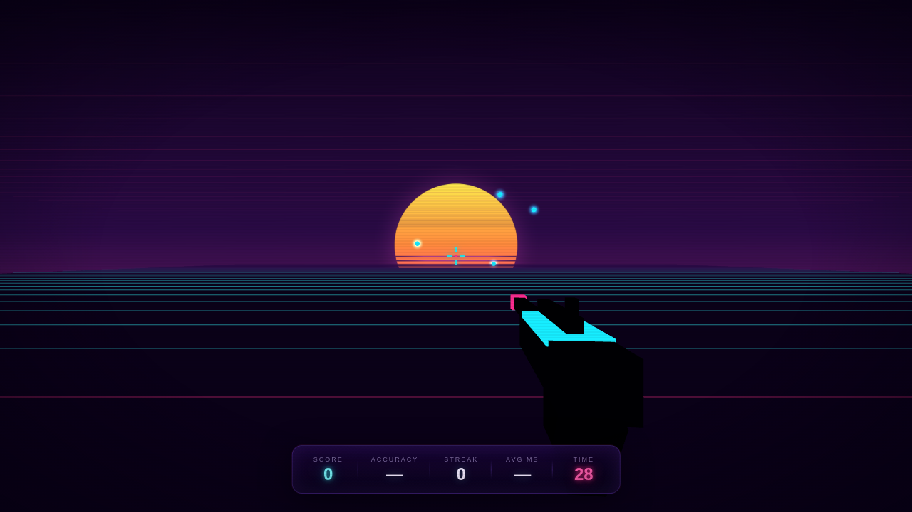

# NEONSHOT — FPS Aim Trainer

A first-person, **synthwave** aim trainer that runs entirely in the browser.
Pointer-lock mouse look, raycast shooting from a fixed crosshair, three
scenarios, and **persistent personal bests** — all client-side, no backend.

> Live: https://lucasdreyer.github.io/aim-trainer-game



## How it plays

- Press **Enter the Grid** — the browser requests pointer lock, then your mouse
  controls the camera (look around) instead of an OS cursor.
- The crosshair is fixed at screen center; **left-click to fire** a ray.
- Press **Esc** to release the mouse; click again to resume.

### Scenarios

| Mode | Goal |
|---|---|
| **Flick** | One target at a time — snap to it and fire. |
| **Gridshot** | A field of targets; clear them as fast as you can. |
| **Tracking** | Targets drift around; keep your aim glued on. |

## Features

- True first-person 3D (Three.js) with a synthwave grid, retro sun, and neon targets
- Pointer-lock mouse look with adjustable **sensitivity**
- Raycast hit detection from the center crosshair
- FPS-style hitmarker, miss flash, combo streaks, and a weapon viewmodel with recoil
- **Persistent stats & personal bests** per scenario × difficulty (localStorage)
- Stats & Records panel with PB table and recent-run history
- Settings (scenario, difficulty, sensitivity) persist between sessions
- **Zero runtime dependencies** — Three.js is vendored into the repo, so the
  site is fully self-contained and works on any static host (and offline)

## Architecture

Plain ES modules — no build step, no framework.

```
index.html            # markup, import map, CRT/HUD/menu shells
style.css             # synthwave design system (CSS custom properties)
vendor/
  three.module.min.js # vendored Three.js (no external CDN at runtime)
src/
  config.js           # scenarios, difficulty tuning, palette, play volume
  storage.js          # localStorage persistence (settings, bests, history)
  scene.js            # renderer, camera, sky/grid/sun, weapon viewmodel
  targets.js          # target spawn/lifecycle/animation + hit resolution
  ui.js               # all DOM: HUD, menu, results, stats modal, feedback
  main.js             # state machine, input, scoring, game loop (entry point)
```

## Running locally

Because it uses native ES modules, open it through a local web server (not the
`file://` protocol):

```bash
git clone https://github.com/LUCASDREYER/aim-trainer-game.git
cd aim-trainer-game
python3 -m http.server 8000
# then visit http://localhost:8000
```

## Deploy (GitHub Pages)

It's a static site, so push to `main` and serve from the repo root
(**Settings → Pages → Deploy from branch → `main` / root**). A `.nojekyll`
file is included so Pages serves the files as-is without Jekyll processing.

## Scoring

| Factor | Effect |
|---|---|
| Reaction time | Faster hits = more points |
| Difficulty | Easy 1×, Medium 1.5×, Hard 2× multiplier |

## License

MIT. Three.js is © its authors, also MIT (see `vendor/THREE.LICENSE`).
